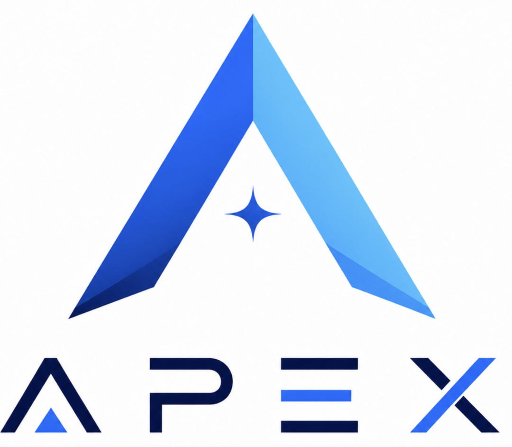
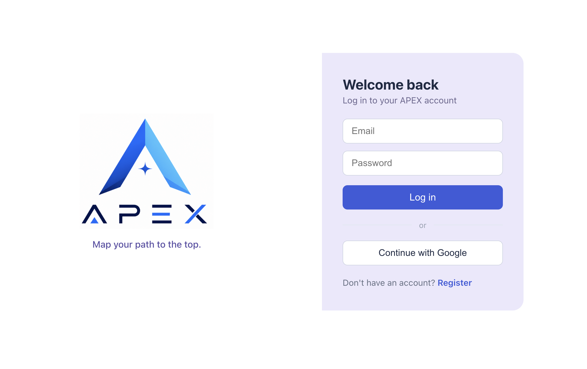
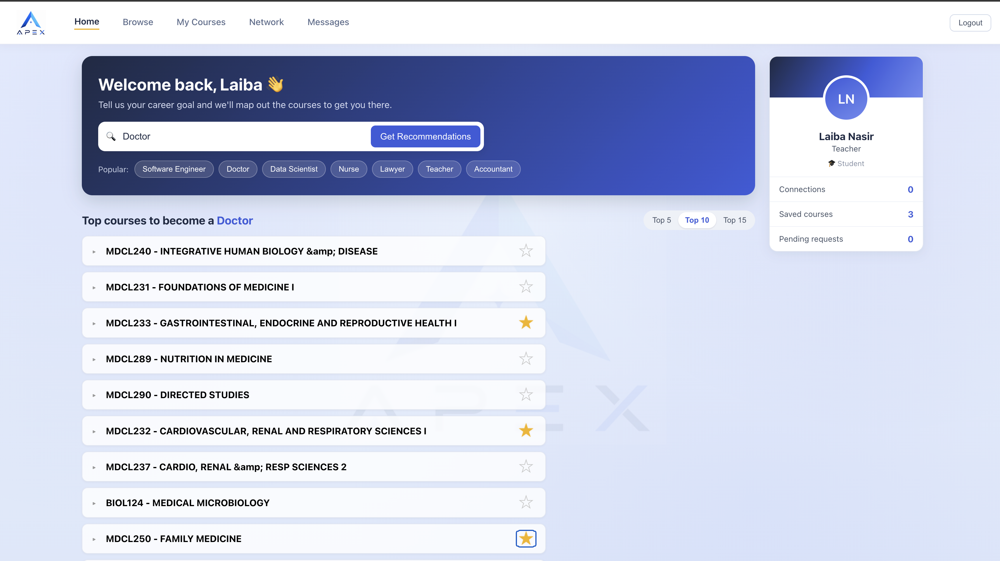
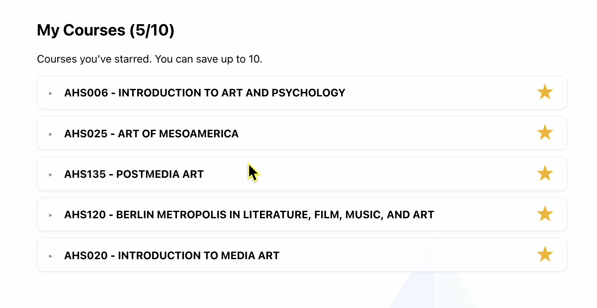
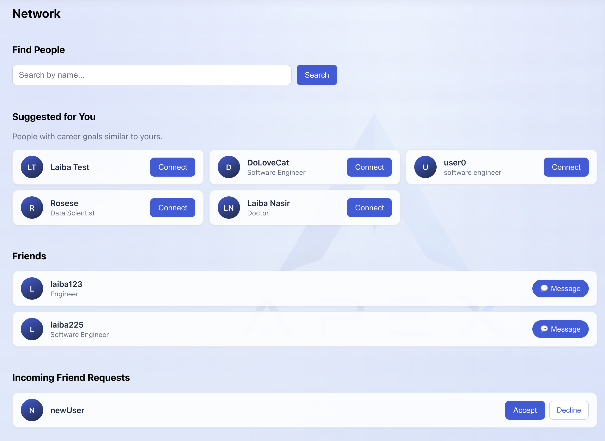
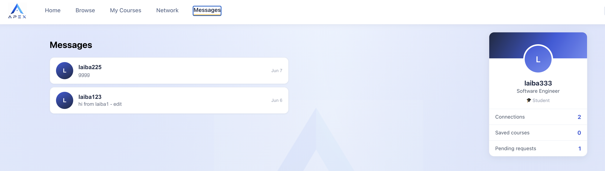
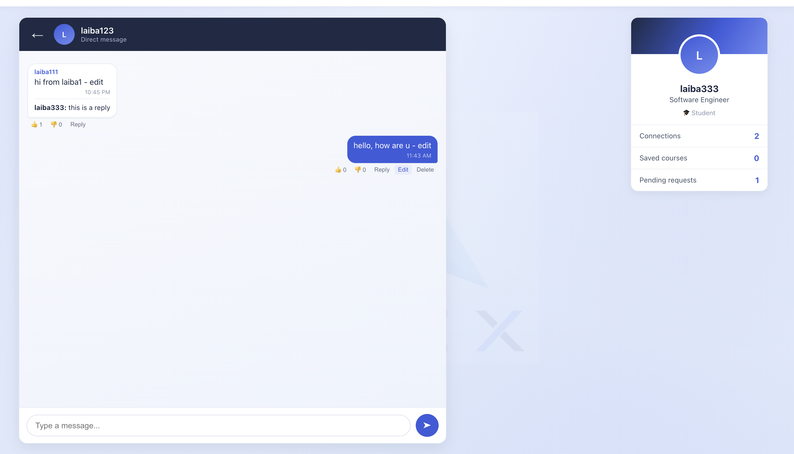

# APEX-Web-Application

  

## Project Overview
- A web app that tailors UCR course recommendations to your career objectives.
- AI-powered career navigation app for UCR students.
- Enter a dream job, get recommended UCR courses and skills to get there, along with a network of relevant people.

## Features
- Google Authentication
- Semantic Search for relevant courses to your career
- Keyword Search all courses at UCR
- Save favorite courses
- Search and add friends
- See friend recommendations based on similiar career goals
- Chat with friends
- Edit profile

## Which tools are used
- Frontend: React
- Backend: Node.js, Express.js
- Database: MongoDB Atlas with Mongoose ODM
- Authentication: bcrypt for password hashing, JSON Web Tokens (JWT)
- Dev Tools: VS Code, Live Server extension, Thunder Client

## Steps on how to run/ deploy code
1. Clone the repo
2. cd into backend folder
3. Create a .env file with: based on the .env.example
4. Run npm install
5. Run npm start
6. Open a second terminal
7. cd into the frontend folder
8. Run npm install
9. Run npm start

 
## Some Page Layouts

### Login
Log in with email and password, or continue with Google.

  

### Home — Course Recommendations
Enter a career goal and get a ranked list of UCR courses to get there.

  

### Saved Courses
Star courses to build your personal plan (save up to 10).

  

### Network
Discover people with similar career goals, connect, and manage friend requests.

  

###  Messages
Chat with your connections in real time.

  
    
  

## Contributions
- Hooman
  - Fetching and Embedding Course Database
  - Implementing semantic search
  - Admin features and page
    
- Rose & Laiba
  - Networking page 
  - Frontend side / Project Design 
  - Register & Login feature
  - JWT Google authentication 
  - User profile 

## AI Usage
In general, we tried to keep AI use to a minimum. If you look at our code, you can see that there are a lot of references to the labs we done throughout the quarter. AI was mainly used to explain code for things that were not covered in class, such as scraping and JWT. We also used AI to help with the css.
