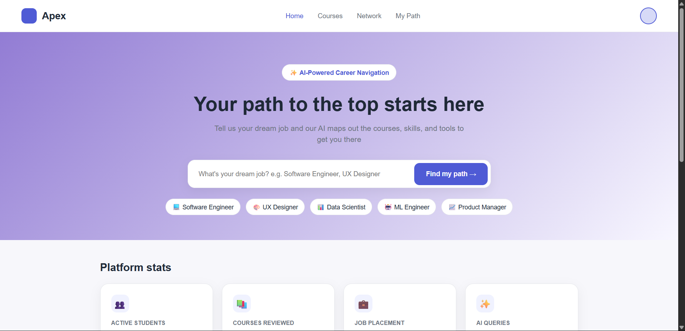
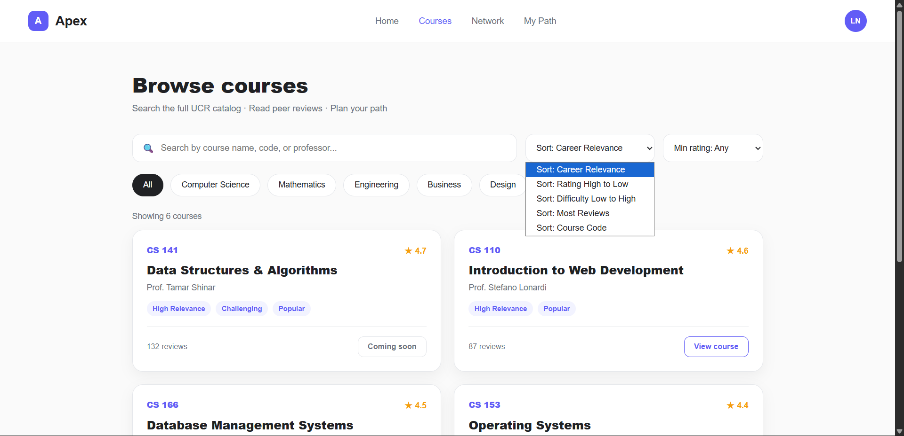

# APEX-Web-Application

  

- A web app that tailors UCR course recommendations to your career objectives.
- AI-powered career navigation app for UCR students
- Enter a dream job, get recommended UCR courses and skills to get there, along with a network of relevant people.

## Which tools are used
- Frontend: Vanilla HTML, CSS, JavaScript (no frameworks)
- Backend: Node.js, Express.js
- Database: MongoDB Atlas with Mongoose ODM
- Authentication: bcrypt for password hashing, JSON Web Tokens (JWT)
- Dev Tools: VS Code, Live Server extension, Thunder Client

## Steps on how to run/ deploy code
1. Clone the repo
2. cd into backend folder
3. Run npm install
4. Create a .env file with: PORT, MONGO_URI (your Atlas connection string), JWT_SECRET
5. Run node server.js (or npm start if you have that script)
6. Open the frontend HTML files with Live Server
7. Backend runs on localhost:5000 (or whatever port), frontend on Live Server's port

## Which Sections Are Working
- [x] User signup with validation and password hashing
- [x] User login with JWT authentication
- [x]  Protected routes via auth middleware
- [x]  Role-based access control (student, mentor, admin)
- [x]  Frontend signup/login forms connected to backend
- [x]  MongoDB Atlas integration

## In-Progress Features
- [ ] **User Profile Management** (Assigned to: **Rose & Laiba**)
  - [ ] Create `GET /profile` endpoint to fetch user data from MongoDB (excluding password hashes).
  - [ ] Create `PUT /profile` endpoint to update whitelisted user fields.
- [ ] **Search Functionality** (Assigned to: **Hooman**)
  - [ ] Implement a search bar to query courses by name or course code.
  - [ ] Add filtering capabilities and build the search results page.
- [ ] **Social Network Feed** (Assigned to: **Laiba & Rose**)
  - [ ] Brainstorming phase: Transitioning from a basic social network to a feature for joining classes or utilizing a ranking algorithm.
  - [ ] Goal: Emulate a social media feed displaying relevant friends and activity on the user's account.
- [ ] **Admin Panel Implementation** (Assigned to: **Laiba**)
  - [ ] Secure Admin-only routes using authorization middleware.
  - [ ] Implement user management tools.
  - [ ] Implement course management capabilities.
 

## Some Page Layouts 

Finish the sort logic in the course page

